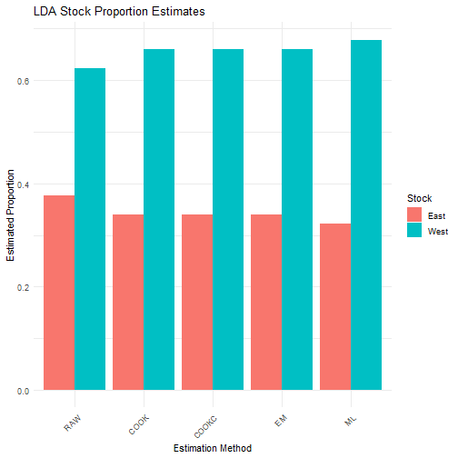

# Applying HISEA estimators to custom classification models with run_hisea_estimates

## Introduction

The
[`run_hisea_estimates()`](https://sosthenea.github.io/RHISEA/reference/run_hisea_estimates.md)
function is a core component of the **RHISEA** package that allows users
to **build their own classification models** and seamlessly integrate
these results into the classical mixed-stock analysis framework
originally implemented by the HISEA program.

HISEA is widely used to estimate the proportions of different source
populations (stocks) within a mixed sample based on known baseline data.
It does so by combining classification outputs with sophisticated
estimators and bootstrap procedures to provide robust stock composition
estimates along with measures of uncertainty.

### Purpose of `run_hisea_estimates()`

This function facilitates the application of **any classification
algorithm** that outputs:

- **Pseudo-class assignments** for each mixture sample (i.e., predicted
  class labels),
- **Class likelihoods or posterior probabilities** for each mixture
  sample (probability of belonging to each stock),
- The **confusion matrix or phi matrix** derived from cross-validation
  on the baseline data, representing classification accuracy and error
  rates.

By accepting these key inputs,
[`run_hisea_estimates()`](https://sosthenea.github.io/RHISEA/reference/run_hisea_estimates.md)
replicates the five classical HISEA estimators:

From Raw estimator (based directly on pseudo-classes) to ML estimator.

This allows users to **combine modern or custom classifiers with the
trusted HISEA estimation framework**, obtaining stock proportion
estimates and associated confidence measures that are directly
comparable to the original HISEA output.

### What you need to provide

To use
[`run_hisea_estimates()`](https://sosthenea.github.io/RHISEA/reference/run_hisea_estimates.md),
you need to supply the following:

- `pseudo_classes`: An integer vector of predicted classes (one per
  mixture individual), as produced by your classifier.
- `likelihoods`: A numeric matrix of posterior probabilities or class
  likelihoods for each mixture individual across all stocks (columns
  correspond to stocks).
- `phi_matrix`: The phi matrix (classification error matrix) computed
  from cross-validation on your baseline data. This matrix captures how
  often each stock is classified as each other stock, accounting for
  misclassification rates.
- `np`: Number of populations or stocks in your baseline data.
- `stocks_names`: Character vector naming each stock in order.
- `type`: Estimation type, typically `"BOOTSTRAP"` for bootstrap
  confidence intervals or `"ANALYSIS"`.
- Additional arguments for output control, such as `export_csv` and
  `output_dir`.

### How it works internally

The function uses the provided pseudo-classes and likelihoods as inputs
to the five estimators implemented in HISEA, incorporating the phi
matrix to adjust for classification uncertainty and errors. It runs
bootstrap replicates to compute confidence intervals and standard
deviations for the estimated stock proportions, enabling statistically
sound inference.

------------------------------------------------------------------------

## 1. Linear Discriminant Analysis (LDA)

We start with a classical parametric classifier, LDA, to illustrate the
workflow.

``` r
# Load required packages
library(MASS)
library(caret)
library(reshape2)
library(ggplot2)
library(RHISEA)

# Load baseline and mixture data
baseline_file <- system.file("extdata", "baseline.rda", package = "RHISEA")
mixture_file <- system.file("extdata", "mixture.rda", package = "RHISEA")

load(baseline_file) # loads `baseline` data.frame
load(mixture_file) # loads `mixture` data.frame

# Prepare baseline data
baseline$population <- as.factor(baseline$population)
stocks_names <- levels(baseline$population)
np <- length(stocks_names)

# Define formula for classification
formula <- population ~ d13c + d18o

# Function to perform stratified k-fold CV and compute phi matrix for LDA
get_cv_results_lda <- function(data, formula, k = 10) {
  set.seed(123)
  folds <- createFolds(data$population, k = k, list = TRUE)

  all_predictions <- factor(rep(NA, nrow(data)), levels = levels(data$population))
  all_probabilities <- matrix(NA,
    nrow = nrow(data), ncol = length(levels(data$population)),
    dimnames = list(NULL, levels(data$population))
  )

  for (i in seq_along(folds)) {
    test_idx <- folds[[i]]
    train_data <- data[-test_idx, ]
    test_data <- data[test_idx, ]

    model <- lda(formula, data = train_data)
    pred <- predict(model, test_data)
    all_predictions[test_idx] <- pred$class
    all_probabilities[test_idx, ] <- pred$posterior
  }

  conf_matrix <- table(Predicted = all_predictions, Actual = data$population)
  phi_matrix <- prop.table(conf_matrix, margin = 2)

  list(
    confusion_matrix = conf_matrix,
    phi_matrix = phi_matrix,
    predictions = all_predictions,
    probabilities = all_probabilities
  )
}

# Run CV and get phi matrix
lda_cv <- get_cv_results_lda(baseline, formula)

# Train full LDA model on baseline
lda_model <- lda(formula, data = baseline)

# Prepare mixture data for prediction
mix_data_prepared <- data.frame(
  d13c = as.numeric(as.character(mixture$d13c_ukn)),
  d18o = as.numeric(as.character(mixture$d18o_ukn))
)

# Predict classes and posterior probabilities for mixture
lda_pred <- predict(lda_model, mix_data_prepared)
lda_classes <- as.integer(lda_pred$class)
lda_probs <- lda_pred$posterior

# Convert phi matrix to numeric matrix if needed
phi_matrix_numeric <- as.matrix(lda_cv$phi_matrix)
phi_matrix_numeric <- matrix(as.numeric(phi_matrix_numeric), nrow = nrow(phi_matrix_numeric), ncol = ncol(phi_matrix_numeric))

# Run HISEA estimates with LDA results
lda_results <- run_hisea_estimates(
  pseudo_classes = lda_classes,
  likelihoods = lda_probs,
  phi_matrix = phi_matrix_numeric,
  np = np,
  type = "BOOTSTRAP",
  stocks_names = stocks_names,
  export_csv = TRUE,
  output_dir = "results_lda",
  verbose = FALSE
)

# Display results
cat("\nLDA Results - Mean Estimates:\n")
```

    ## 
    ## LDA Results - Mean Estimates:

``` r
print(lda_results$mean_estimates)
```

    ##            RAW      COOK     COOKC        EM        ML
    ## East 0.3769222 0.3399873 0.3399873 0.3399875 0.3215246
    ## West 0.6230778 0.6600127 0.6600127 0.6600125 0.6784754

``` r
cat("\nLDA Results - Standard Deviations:\n")
```

    ## 
    ## LDA Results - Standard Deviations:

``` r
print(lda_results$sd_estimates)
```

    ##              RAW        COOK       COOKC          EM          ML
    ## East 0.007109503 0.008140653 0.008140653 0.008140603 0.008542696
    ## West 0.007109503 0.008140653 0.008140653 0.008140603 0.008542696

``` r
# Visualization of results
results_long <- melt(lda_results$mean_estimates)
colnames(results_long) <- c("Stock", "Method", "Proportion")

ggplot(results_long, aes(x = Method, y = Proportion, fill = Stock)) +
  geom_bar(stat = "identity", position = "dodge") +
  theme_minimal() +
  labs(
    title = "LDA Stock Proportion Estimates",
    y = "Estimated Proportion",
    x = "Estimation Method"
  ) +
  theme(axis.text.x = element_text(angle = 45, hjust = 1))
```



plot of chunk lda

------------------------------------------------------------------------

## 2. Random Forest (RF)

Next, we apply Random Forest, a powerful ensemble learning method.

``` r
library(randomForest)

# Function to perform stratified k-fold CV and compute phi matrix for RF
get_cv_results_rf <- function(data, formula, k = 10, ntree = 500) {
  set.seed(123)
  folds <- createFolds(data$population, k = k, list = TRUE)

  all_predictions <- factor(rep(NA, nrow(data)), levels = levels(data$population))
  all_probabilities <- matrix(NA,
    nrow = nrow(data), ncol = length(levels(data$population)),
    dimnames = list(NULL, levels(data$population))
  )

  for (i in seq_along(folds)) {
    test_idx <- folds[[i]]
    train_data <- data[-test_idx, ]
    test_data <- data[test_idx, ]

    model <- randomForest(formula, data = train_data, ntree = ntree)
    all_predictions[test_idx] <- predict(model, test_data)
    all_probabilities[test_idx, ] <- predict(model, test_data, type = "prob")
  }

  conf_matrix <- table(Predicted = all_predictions, Actual = data$population)
  phi_matrix <- prop.table(conf_matrix, margin = 2)

  list(
    confusion_matrix = conf_matrix,
    phi_matrix = phi_matrix,
    predictions = all_predictions,
    probabilities = all_probabilities
  )
}

# Run CV and get phi matrix
rf_cv <- get_cv_results_rf(baseline, formula, ntree = 500)

# Train full RF model on baseline
rf_model <- randomForest(formula, data = baseline, ntree = 500)

# Predict classes and posterior probabilities for mixture
rf_probs <- predict(rf_model, mix_data_prepared, type = "prob")
rf_classes <- as.integer(predict(rf_model, mix_data_prepared))

# Run HISEA estimates with RF results
rf_results <- run_hisea_estimates(
  pseudo_classes = rf_classes,
  likelihoods = rf_probs,
  phi_matrix = rf_cv$phi_matrix,
  np = np,
  type = "BOOTSTRAP",
  stocks_names = stocks_names,
  export_csv = TRUE,
  output_dir = "results_rf",
  verbose = FALSE
)

# Display results
cat("\nRandom Forest Results - Mean Estimates:\n")
```

    ## 
    ## Random Forest Results - Mean Estimates:

``` r
print(rf_results$mean_estimates)
```

    ##            RAW      COOK     COOKC        EM        ML
    ## East 0.3804471 0.3790505 0.3790505 0.3790505 0.3514208
    ## West 0.6195529 0.6209495 0.6209495 0.6209495 0.6485792

``` r
cat("\nRandom Forest Results - Standard Deviations:\n")
```

    ## 
    ## Random Forest Results - Standard Deviations:

``` r
print(rf_results$sd_estimates)
```

    ##              RAW        COOK       COOKC          EM          ML
    ## East 0.007404837 0.007933754 0.007933754 0.007933747 0.008880836
    ## West 0.007404837 0.007933754 0.007933754 0.007933747 0.008880836

``` r
# Visualization of results
results_long <- melt(rf_results$mean_estimates)
colnames(results_long) <- c("Stock", "Method", "Proportion")

ggplot(results_long, aes(x = Method, y = Proportion, fill = Stock)) +
  geom_bar(stat = "identity", position = "dodge") +
  theme_minimal() +
  labs(
    title = "Random Forest Stock Proportion Estimates",
    y = "Estimated Proportion",
    x = "Estimation Method"
  ) +
  theme(axis.text.x = element_text(angle = 45, hjust = 1))
```


plot of chunk rf

------------------------------------------------------------------------

## 3. Conditional Inference Tree (CTREE)

Finally, we demonstrate a non-parametric tree method based on
permutation tests.

``` r
library(party)

# Function to perform stratified k-fold CV and compute phi matrix for CTREE
get_cv_results_ctree <- function(data, formula, k = 10) {
  set.seed(123)
  folds <- createFolds(data$population, k = k, list = TRUE)

  all_predictions <- factor(rep(NA, nrow(data)), levels = levels(data$population))
  all_probabilities <- matrix(NA,
    nrow = nrow(data), ncol = length(levels(data$population)),
    dimnames = list(NULL, levels(data$population))
  )

  for (i in seq_along(folds)) {
    test_idx <- folds[[i]]
    train_data <- data[-test_idx, ]
    test_data <- data[test_idx, ]

    model <- ctree(formula, data = train_data)
    pred_probs <- predict(model, test_data, type = "prob")
    pred_probs_matrix <- do.call(rbind, pred_probs)
    all_predictions[test_idx] <- predict(model, test_data)
    all_probabilities[test_idx, ] <- pred_probs_matrix
  }

  conf_matrix <- table(Predicted = all_predictions, Actual = data$population)
  phi_matrix <- prop.table(conf_matrix, margin = 2)

  list(
    confusion_matrix = conf_matrix,
    phi_matrix = phi_matrix,
    predictions = all_predictions,
    probabilities = all_probabilities
  )
}

# Run CV and get phi matrix
ctree_cv <- get_cv_results_ctree(baseline, formula)
```

    ## Error in do.call(rbind, pred_probs): second argument must be a list

``` r
# Train full CTREE model on baseline
ctree_model <- ctree(formula,
  data = baseline,
  controls = ctree_control(
    mincriterion = 0.95,
    minsplit = 20,
    minbucket = 7
  )
)
```

    ## Error in ctree_control(...): unused argument (controls = list("p.value", -0.0512932943875506, 20, 7, 0.01, Inf, FALSE, c(Inf, Inf), FALSE, Inf, Inf, FALSE, 2, 0, FALSE, FALSE, TRUE, function (X, FUN, ...) 
    ## {
    ##     FUN <- match.fun(FUN)
    ##     if (!is.vector(X) || is.object(X)) X <- as.list(X)
    ##     .Internal(lapply(X, FUN))
    ## }, TRUE, TRUE, NULL, function (model, trafo, data, subset, weights, whichvar, ctrl) 
    ## {
    ##     args <- list(...)
    ##     ctrl[names(args)] <- args
    ##     .select(model, trafo, data, subset, weights, whichvar, ctrl, FUN = .ctree_test)
    ## }, function (model, trafo, data, subset, weights, whichvar, ctrl) 
    ## {
    ##     args <- list(...)
    ##     ctrl[names(args)] <- args
    ##     .split(model, trafo, data, subset, weights, whichvar, ctrl, FUN = .ctree_test)
    ## }, function (model, trafo, data, subset, weights, whichvar, ctrl) 
    ## {
    ##     args <- list(...)
    ##     ctrl[names(args)] <- args
    ##     .select(model, trafo, data, subset, weights, whichvar, ctrl, FUN = .ctree_test)
    ## }, function (model, trafo, data, subset, weights, whichvar, ctrl) 
    ## {
    ##     args <- list(...)
    ##     ctrl[names(args)] <- args
    ##     .split(model, trafo, data, subset, weights, whichvar, ctrl, FUN = .ctree_test)
    ## }, "quadratic", "quadratic", FALSE, list(25000, 0.001, 0), "Bonferroni", 9999, 1.49011611938477e-08, FALSE, FALSE))

``` r
# Predict classes and posterior probabilities for mixture
ctree_probs <- predict(ctree_model, mix_data_prepared, type = "prob")
ctree_probs_matrix <- do.call(rbind, ctree_probs)
ctree_classes <- as.integer(predict(ctree_model, mix_data_prepared))

# Run HISEA estimates with CTREE results
ctree_results <- run_hisea_estimates(
  pseudo_classes = ctree_classes,
  likelihoods = ctree_probs_matrix,
  phi_matrix = ctree_cv$phi_matrix,
  np = np,
  type = "BOOTSTRAP",
  stocks_names = stocks_names,
  export_csv = TRUE,
  output_dir = "results_ctree",
  verbose = FALSE
)

# Display results
cat("\nCTREE Results - Mean Estimates:\n")
```

    ## 
    ## CTREE Results - Mean Estimates:

``` r
print(ctree_results$mean_estimates)
```

    ##            RAW      COOK     COOKC        EM       ML
    ## East 0.4023718 0.3890588 0.3890588 0.3890588 0.328979
    ## West 0.5976282 0.6109412 0.6109412 0.6109412 0.671021

``` r
cat("\nCTREE Results - Standard Deviations:\n")
```

    ## 
    ## CTREE Results - Standard Deviations:

``` r
print(ctree_results$sd_estimates)
```

    ##              RAW        COOK       COOKC         EM          ML
    ## East 0.007095196 0.008062722 0.008062722 0.00806272 0.008600688
    ## West 0.007095196 0.008062722 0.008062722 0.00806272 0.008600688

``` r
# Visualize tree and results
plot(ctree_model)
```


plot of chunk ctree

``` r
results_long <- melt(ctree_results$mean_estimates)
colnames(results_long) <- c("Stock", "Method", "Proportion")

ggplot(results_long, aes(x = Method, y = Proportion, fill = Stock)) +
  geom_bar(stat = "identity", position = "dodge") +
  theme_minimal() +
  labs(
    title = "CTREE Stock Proportion Estimates",
    y = "Estimated Proportion",
    x = "Estimation Method"
  ) +
  theme(axis.text.x = element_text(angle = 45, hjust = 1))
```


plot of chunk ctree

------------------------------------------------------------------------

## Conclusion

This vignette demonstrated how to:

- Prepare baseline and mixture data,
- Perform stratified cross-validation to estimate classification
  accuracy (phi matrix),
- Train various classifiers (LDA, RF, CTREE),
- Predict mixture sample classes and posterior probabilities,
- Run
  [`run_hisea_estimates()`](https://sosthenea.github.io/RHISEA/reference/run_hisea_estimates.md)
  to get robust mixed-stock proportion estimates with confidence
  intervals,
- Visualize and interpret the results.

You can extend this approach to any classification method that provides
pseudo-classes and posterior probabilities, leveraging the classical
HISEA framework within the **RHISEA** package.
