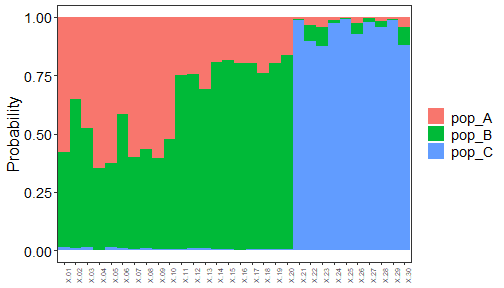
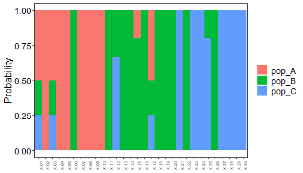

## Overview

This tutorial illustrates how to integrate individual-level genetic assignment results into RHISEA to estimate mixed-stock proportions. It uses genotype data in GENEPOP format, processed with adegenet and assignPOP, and then feeds assignment probabilities and confusion matrices to `run_hisea_estimates()` for population-scale mixing estimates.

The workflow includes:  
- Converting GENEPOP data to an adegenet/assignPOP-compatible format  
- Performing Monte Carlo and K-fold cross-validation for assignment accuracy  
- Generating individual assignment probabilities and confusion matrices  
- Passing these outputs to RHISEA for mixed-stock estimation.

## Data preparation and import

In this section, genotype data in GENEPOP format are read and filtered, then combined with morphometric data to create an integrated baseline dataset.


``` r
# Read baseline GENEPOP data and reduce low-variance loci
YourGenepop <- read.Genepop(
  "https://raw.githubusercontent.com/alexkychen/assignPOP/master/inst/extdata/simGenepop.txt",
  pop.names = c("pop_A", "pop_B", "pop_C"),
  haploid = FALSE
)
#> 
#>   Converting data format...
#> 
#>   Encoding genetic data...
#> 
#>   ################ assignPOP v1.3.1 ################
#> 
#>   A GENEPOP format file was successfully imported!
#> 
#>   Imported Data Info: 90 obs. by 1000 loci (diploid)
#>   Number of pop: 3
#>   Number of inds (pop_A): 30
#>   Number of inds (pop_B): 30
#>   Number of inds (pop_C): 30
#>   DataMatrix: 90 rows by 2001 columns, with 2000 allele variables
#> 
#>   Data output in a list comprising the following three elements:
#>   YOUR_LIST_NAME$DataMatrix
#>   YOUR_LIST_NAME$SampleID
#>   YOUR_LIST_NAME$LocusName

YourGenepopRd <- reduce.allele(YourGenepop, p = 0.95)
#> 
#>   New data matrix has created! :)
#>   New DataMatrix size: 90 rows by 1387 columns
#>   614 columns (alleles) have been removed
#>   693 loci remaining

# Integrate genetic and morphometric data
YourIntegrateData <- compile.data(
  YourGenepopRd,
  "https://raw.githubusercontent.com/alexkychen/assignPOP/master/inst/extdata/morphData.csv"
)
#>   Import a .CSV file.
#>   4 additional variables detected.
#>   Checking variable data type...
#>    D1.2(integer)   D2.3(integer)   D3.4(integer)   D1.4(integer)  please enter variable names for changing data type (separate names by a whitespace if multiple)
#> Error in compile.data(YourGenepopRd, "https://raw.githubusercontent.com/alexkychen/assignPOP/master/inst/extdata/morphData.csv"): Please enter correct feature names.

# Import morphometric data
morphdf <- read.csv(
  "https://raw.githubusercontent.com/alexkychen/assignPOP/master/inst/extdata/morphData.csv",
  header = TRUE
)
```

Population labels are then constructed and appended to the morphometric dataset, illustrating both character and numeric encodings.


``` r
# Population labels as characters
pop_label_char <- c(rep("pop_A", 30), rep("pop_B", 30), rep("pop_C", 30))
morphdf_pop_char <- cbind(morphdf, pop_label = pop_label_char)

# Population labels as numeric factors
pop_label_num <- c(rep(1, 30), rep(2, 30), rep(3, 30))
morphdf_pop <- cbind(morphdf, pop_label = pop_label_num)
morphdf_pop$pop_label <- as.factor(morphdf_pop$pop_label)
```

## Assignment cross-validation

Monte Carlo and K-fold cross-validation are used to evaluate assignment performance for different training proportions and subsets of loci.


``` r
# Monte Carlo cross-validation using SVM
assign.MC(
  YourGenepopRd,
  train.inds = c(0.5, 0.7, 0.9),
  train.loci = c(0.1, 0.25, 0.5, 1),
  loci.sample = "fst",
  iterations = 30,
  model = "svm",
  dir = "Result-folder/"
)
#> 
#>   Parallel computing is on. Analyzing data using 11 cores/threads of CPU...
#> 
#>   Monte-Carlo cross-validation done!!
#>   360 assignment tests completed!!

# K-fold cross-validation using LDA
assign.kfold(
  YourGenepopRd,
  k.fold = c(3, 4, 5),
  train.loci = c(0.1, 0.25, 0.5, 1),
  loci.sample = "random",
  model = "lda",
  dir = "Result-folder2/"
)
#> 
#>   Parallel computing is on. Analyzing data using 11 cores/threads of CPU...
#> 
#>   K-fold cross-validation done!!
#>   48 assignment tests completed!!
```

Cross-validation outputs are summarized to quantify classification accuracy across scenarios.


``` r
accuMC <- accuracy.MC(dir = "Result-folder/") # Monte Carlo accuracy
#> 
#>   Correct assignment rates were estimated!!
#>   A total of 360 assignment tests for 3 pops.
#>   Results were also saved in a 'Rate_of_360_tests_3_pops.txt' file in the directory.
accuKF <- accuracy.kfold(dir = "Result-folder2/") # K-fold accuracy
#> 
#>   Correct assignment rates were estimated!!
#>   A total of 48 assignment tests for 3 pops.
#>   Results were also saved in a 'Rate_of_48_tests_3_pops.txt' file in the directory.

# Quick inspection of accuracy objects
str(accuMC)
#> 'data.frame':	360 obs. of  7 variables:
#>  $ train.inds       : Factor w/ 3 levels "0.5","0.7","0.9": 1 1 1 1 1 1 1 1 1 1 ...
#>  $ train.loci       : Factor w/ 4 levels "0.1","0.25","0.5",..: 1 1 1 1 1 1 1 1 1 1 ...
#>  $ iters            : Factor w/ 30 levels "1","10","11",..: 1 2 3 4 5 6 7 8 9 10 ...
#>  $ assign.rate.all  : num  0.711 0.667 0.6 0.622 0.6 ...
#>  $ assign.rate.pop_A: num  0.533 0.267 0.4 0.467 0.467 ...
#>  $ assign.rate.pop_B: num  0.667 0.8 0.467 0.533 0.333 ...
#>  $ assign.rate.pop_C: num  0.933 0.933 0.933 0.867 1 ...
str(accuKF)
#> 'data.frame':	48 obs. of  7 variables:
#>  $ KF               : Factor w/ 3 levels "3","4","5": 1 1 1 2 2 2 2 3 3 3 ...
#>  $ fold             : Factor w/ 5 levels "1","2","3","4",..: 1 2 3 1 2 3 4 1 2 3 ...
#>  $ train.loci       : Factor w/ 4 levels "0.1","0.25","0.5",..: 1 1 1 1 1 1 1 1 1 1 ...
#>  $ assign.rate.all  : num  0.667 0.733 0.333 0.522 0.652 ...
#>  $ assign.rate.pop_A: num  0.7 0.6 0.4 0.25 0.625 ...
#>  $ assign.rate.pop_B: num  0.3 0.6 0.2 0.5 0.429 ...
#>  $ assign.rate.pop_C: num  1 1 0.4 0.857 0.875 ...
```

## Assignment of unknown individuals

Unknown individuals are imported and assigned using both genetic-only and integrated data with different classifiers.


``` r
# Import GENEPOP file for unknown individuals
YourGenepopUnknown <- read.Genepop(
  "https://raw.githubusercontent.com/alexkychen/assignPOP/master/inst/extdata/simGenepopX.txt"
)
#> 
#>   Converting data format...
#> 
#>   Encoding genetic data...
#> 
#>   ################ assignPOP v1.3.1 ################
#> 
#>   A GENEPOP format file was successfully imported!
#> 
#>   Imported Data Info: 30 obs. by 1000 loci (diploid)
#>   Number of pop: 1
#>   Number of inds (pop.1): 30
#>   DataMatrix: 30 rows by 1835 columns, with 1834 allele variables
#> 
#>   Data output in a list comprising the following three elements:
#>   YOUR_LIST_NAME$DataMatrix
#>   YOUR_LIST_NAME$SampleID
#>   YOUR_LIST_NAME$LocusName

# Integrate genetic and morphometric data for unknowns
YourIntegrateUnknown <- compile.data(
  YourGenepopUnknown,
  "https://raw.githubusercontent.com/alexkychen/assignPOP/master/inst/extdata/morphDataX.csv"
)
#>   Import a .CSV file.
#>   4 additional variables detected.
#>   Checking variable data type...
#>    D1.2(integer)   D2.3(integer)   D3.4(integer)   D1.4(integer)  please enter variable names for changing data type (separate names by a whitespace if multiple)
#> Error in compile.data(YourGenepopUnknown, "https://raw.githubusercontent.com/alexkychen/assignPOP/master/inst/extdata/morphDataX.csv"): Please enter correct feature names.

# Non-genetic data only
NonGeneticUnknown <- read.csv(
  "https://raw.githubusercontent.com/alexkychen/assignPOP/master/inst/extdata/morphDataX.csv",
  header = TRUE
)
```

Two assignment models are illustrated: naive Bayes using genetic data and a decision tree using integrated data.


``` r
# 1. Assignment using genetic data and naive Bayes
assign.X(
  x1 = YourGenepopRd,
  x2 = YourGenepopUnknown,
  dir = "Result-folder3/",
  model = "naiveBayes"
)
#> 
#>   Known and unknown datasets have unequal features.
#>   Automatically identify common features between datasets...
#>    1375 features are used for assignment.
#>   Performing PCA on genetic data for dimensionality reduction...
#>   Assignment test is done! See results in your designated folder.
#>   Predicted populations and probabilities are saved in [AssignmentResult.txt]
```

<div class="figure">

<p class="caption">plot of chunk assignment_tests_naives_Bayes</p>
</div>


``` r
# 2. Assignment using integrated data and decision tree
assign.X(
  x1 = YourIntegrateData,
  x2 = YourIntegrateUnknown,
  dir = "Result-folder4/",
  model = "tree"
)
#> 
#>   Known and unknown datasets have unequal features.
#>   Automatically identify common features between datasets...
#>    1379 features are used for assignment.
#>   Performing PCA on concatenated genetic and non-genetic data...
#>   Assignment test is done! See results in your designated folder.
#>   Predicted populations and probabilities are saved in [AssignmentResult.txt]
```

<div class="figure">

<p class="caption">plot of chunk assignment_tests_decision_tree</p>
</div>

## From assignment matrices to RHISEA inputs

assignPOP can produce a membership matrix for individuals, and RHISEA requires a misclassification (phi) matrix describing baseline stock confusion rates. Here, an example `assign.matrix` output is converted to the `phi_matrix` format expected by `run_hisea_estimates()`.


``` r
# Default: read all files in the specified Monte Carlo result folder
AM <- assign.matrix(dir = "Result-folder/")
#> Assignment across 360 tests from Monte-Carlo cross-validation.
#>  Mean 
#>        assignment
#> origin  pop_A pop_B pop_C
#>   pop_A  0.57  0.42  0.01
#>   pop_B  0.39  0.52  0.09
#>   pop_C  0.02  0.06  0.92
#> 
#>  Standard Deviation 
#>        assignment
#> origin  pop_A pop_B pop_C
#>   pop_A  0.24  0.23  0.04
#>   pop_B  0.24  0.26  0.11
#>   pop_C  0.05  0.09  0.11

# Example confusion matrix (phi matrix) constructed from assignment results
AM_df <- data.frame(
  origin = c("pop_A", "pop_B", "pop_C"),
  pop_A  = c(0.25, 0.25, 0.05),
  pop_B  = c(0.25, 0.25, 0.10),
  pop_C  = c(0.05, 0.10, 0.10)
)

AM_matrix <- as.matrix(AM_df[, -1])
rownames(AM_matrix) <- AM_df$origin
colnames(AM_matrix) <- colnames(AM_df)[-1]

stocks_names <- c("pop_A", "pop_B", "pop_C")
```

Individual-level assignment probabilities are then extracted from the decision-tree assignment output and formatted for RHISEA.


``` r
# Read assignment results from integrated-data decision tree model
LDA_assign <- data.table::as.data.table(
  read.table( "Result-folder4/AssignmentResult.txt",header = TRUE)
)

# Convert predicted populations to integer class labels
LDA_classes <- as.integer(as.factor(LDA_assign$pred.pop))

# Extract assignment probabilities (one column per stock)
LDA_probs <- as.matrix(LDA_assign[, c(3, 4, 5)])
```

## Mixed-stock estimation with RHISEA

Finally, RHISEA is used to convert the individual assignment results and misclassification matrix into unbiased estimates of stock mixing proportions using bootstrap resampling.


``` r
results_LDA <- run_hisea_estimates(
  pseudo_classes = LDA_classes,
  likelihoods    = LDA_probs,
  phi_matrix     = AM_matrix,
  np             = 3,
  type           = "BOOTSTRAP",
  stocks_names   = stocks_names,
  export_csv     = TRUE,
  output_dir     = "rf_results_4Mod",
  verbose        = TRUE
)

print(results_LDA$mean_estimates)
#>             RAW      COOK     COOKC           EM        ML
#> pop_A 0.3294333 -2.185200 0.1036895 8.443711e-05 0.2795586
#> pop_B 0.3679333  3.348933 0.6128743 9.999156e-01 0.4172419
#> pop_C 0.3026333  0.770000 0.2834362 0.000000e+00 0.3031994
print(results_LDA$sd_estimates)
#>              RAW     COOK     COOKC         EM         ML
#> pop_A 0.08345044 4.660601 0.2621710 0.00108754 0.08646360
#> pop_B 0.08617321 5.406886 0.4706756 0.00108754 0.09765233
#> pop_C 0.08385893 2.949391 0.4073490 0.00000000 0.09197509
```


This workflow demonstrates how genetic classification output from an external, widely used assignment framework (for example, individual probability classification with the assignPOP package) can be directly integrated into RHISEA, enabling mixed-stock estimation that explicitly accounts for both assignment uncertainty and baseline misclassification.

This highlights the adaptive capacity of RHISEA and shows that the package can flexibly incorporate different genetic assignment pipelines without imposing restrictive assumptions on how individual probabilities are generated.
