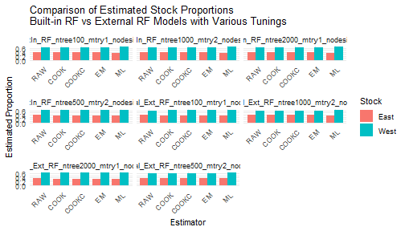

# 1) Data Preparation

We start by loading the baseline and mixture datasets and preparing them.


``` r
baseline_file <- system.file("extdata", "baseline.rda", package = "RHISEA")
mixture_file <- system.file("extdata", "mixture.rda", package = "RHISEA")
load(baseline_file)
load(mixture_file)

baseline$population <- as.factor(baseline$population)
stocks_names <- levels(baseline$population)
np <- length(stocks_names)
nv <- 2
Nsamps <- 1000
Nmix <- nrow(mixture)
resample_baseline <- FALSE
resampled_baseline_sizes <- c(50, 50)
stock_labels <- c("East", "West")
```

# 2) Using `run_hisea_all()` with Built-in Models

Run RHISEA analyses using the built-in Random Forest and LDA models, specifying `phi_method` as either "standard" or "cv".


``` r
# Run LDA with standard phi matrix
LDA_results <- run_hisea_all(
  type = "ANALYSIS",
  np = np,
  phi_method = "standard",
  nv = nv,
  resample_baseline = resample_baseline,
  resampled_baseline_sizes = resampled_baseline_sizes,
  seed_val = 123,
  nsamps = Nsamps,
  Nmix = Nmix,
  actual = NULL,
  baseline_input = baseline,
  mix_input = mixture,
  method_class = "LDA",
  stocks_names = stock_labels,
  stock_col = "population",
  var_cols_std = c("d13c", "d18o"),
  var_cols_mix = c("d13c_ukn", "d18o_ukn")
)

round(LDA_results$mean, 4)
#>         RAW   COOK  COOKC     EM     ML
#> East 0.3771 0.3376 0.3376 0.3376 0.3217
#> West 0.6229 0.6624 0.6624 0.6624 0.6783
```


``` r
# Run RF with cross-validation phi matrix
RF_results <- run_hisea_all(
  type = "ANALYSIS",
  np = np,
  phi_method = "cv",
  nv = nv,
  resample_baseline = resample_baseline,
  resampled_baseline_sizes = resampled_baseline_sizes,
  seed_val = 123,
  nsamps = Nsamps,
  Nmix = Nmix,
  actual = NULL,
  baseline_input = baseline,
  mix_input = mixture,
  method_class = "RF",
  stocks_names = stock_labels,
  stock_col = "population",
  var_cols_std = c("d13c", "d18o"),
  var_cols_mix = c("d13c_ukn", "d18o_ukn"),
  ntree = 500
)

round(RF_results$mean, 4)
#>         RAW   COOK  COOKC     EM     ML
#> East 0.3807 0.3793 0.3793 0.3793 0.3516
#> West 0.6193 0.6207 0.6207 0.6207 0.6484
```

# 3) Testing Parameters: `phi_method` and `type` in RF Model

Run analyses comparing `phi_method` ("standard" vs "cv") and types ("ANALYSIS" vs "BOOTSTRAP") for Random Forest.


``` r
phi_methods <- c("standard", "cv")
types <- c("ANALYSIS", "BOOTSTRAP")
results_list <- list()

for (phi_m in phi_methods) {
  for (typ in types) {
    cat(sprintf("Running RF with type = %s, phi_method = %s\n", typ, phi_m))
    args <- list(
      type = typ,
      np = np,
      phi_method = phi_m,
      nv = nv,
      resample_baseline = resample_baseline,
      resampled_baseline_sizes = resampled_baseline_sizes,
      seed_val = 123,
      nsamps = Nsamps,
      Nmix = Nmix,
      actual = NULL,
      baseline_input = baseline,
      mix_input = mixture,
      method_class = "RF",
      stocks_names = stock_labels,
      stock_col = "population",
      var_cols_std = c("d13c", "d18o"),
      var_cols_mix = c("d13c_ukn", "d18o_ukn"),
      ntree = 500
    )
    res <- do.call(run_hisea_all, args)
    key <- paste("RF", typ, phi_m, sep = "_")
    results_list[[key]] <- res
    cat("Mean stock estimates:\n")
    print(round(res$mean_estimates, 4))
    cat("\n\n")
  }
}
#> Running RF with type = ANALYSIS, phi_method = standard
#> Mean stock estimates:
#>         RAW   COOK  COOKC     EM     ML
#> East 0.3789 0.3789 0.3789 0.3789 0.3484
#> West 0.6211 0.6211 0.6211 0.6211 0.6516
#> 
#> 
#> Running RF with type = BOOTSTRAP, phi_method = standard
#> Mean stock estimates:
#>         RAW   COOK  COOKC     EM     ML
#> East 0.3787 0.3787 0.3787 0.3787 0.3485
#> West 0.6213 0.6213 0.6213 0.6213 0.6515
#> 
#> 
#> Running RF with type = ANALYSIS, phi_method = cv
#> Mean stock estimates:
#>         RAW   COOK  COOKC     EM     ML
#> East 0.3807 0.3793 0.3793 0.3793 0.3516
#> West 0.6193 0.6207 0.6207 0.6207 0.6484
#> 
#> 
#> Running RF with type = BOOTSTRAP, phi_method = cv
#> Mean stock estimates:
#>         RAW COOK COOKC   EM     ML
#> East 0.3907 0.39  0.39 0.39 0.3588
#> West 0.6093 0.61  0.61 0.61 0.6412
```

# 4) Using `run_hisea_estimates()` with External Models and Comparison

Train external LDA and RF models and provide their outputs with appropriate phi matrices to `run_hisea_estimates()` for estimation, comparing internal and external results.


``` r
# Function to perform stratified k-fold CV and compute phi matrix for LDA
get_phi_results_lda_standard <- function(data, formula) {
  # Entraînement du modèle LDA sur l'ensemble complet
  model <- lda(formula, data = data)

  # Prédiction des classes et probabilités sur le même jeu de données
  pred <- predict(model, data)
  all_predictions <- pred$class
  all_probabilities <- pred$posterior

  # Matrice de confusion (in-sample)
  conf_matrix <- table(Predicted = all_predictions, Actual = data$population)

  # Matrice phi normalisée par colonne (probabilité conditionnelle)
  phi_matrix <- prop.table(conf_matrix, margin = 2)

  list(
    confusion_matrix = conf_matrix,
    phi_matrix = phi_matrix,
    predictions = all_predictions,
    probabilities = all_probabilities
  )
}

# External LDA phi and estimates
lda_formula <- population ~ d13c + d18o
lda_cv_phi <- get_phi_results_lda_standard(baseline, lda_formula)

lda_model <- lda(lda_formula, data = baseline)
mix_prepared <- data.frame(
  d13c = as.numeric(as.character(mixture$d13c_ukn)),
  d18o = as.numeric(as.character(mixture$d18o_ukn))
)
lda_pred <- predict(lda_model, mix_prepared)
lda_classes <- as.integer(lda_pred$class)
lda_probs <- lda_pred$posterior

lda_ext_results <- run_hisea_estimates(
  pseudo_classes = lda_classes,
  likelihoods = lda_probs,
  phi_matrix = as.matrix(lda_cv_phi$phi_matrix),
  np = np,
  type = "ANALYSIS",
  stocks_names = stocks_names,
  export_csv = FALSE
)

print(round(lda_ext_results$mean_estimates, 4))
#>         RAW   COOK  COOKC     EM     ML
#> East 0.3771 0.3376 0.3376 0.3376 0.3217
#> West 0.6229 0.6624 0.6624 0.6624 0.6783
```


``` r
# External RF phi and estimates
get_cv_results_rf <- function(data, formula, k = 10, ntree = 500) {
  set.seed(123)
  folds <- createFolds(data$population, k = k, list = TRUE)
  all_predictions <- factor(rep(NA, nrow(data)), levels = levels(data$population))
  all_probabilities <- matrix(NA,
    nrow = nrow(data), ncol = length(levels(data$population)),
    dimnames = list(NULL, levels(data$population))
  )
  for (i in seq_along(folds)) {
    test_idx <- folds[[i]]
    train_data <- data[-test_idx, ]
    test_data <- data[test_idx, ]
    model <- randomForest(formula, data = train_data, ntree = ntree)
    all_predictions[test_idx] <- predict(model, test_data)
    all_probabilities[test_idx, ] <- predict(model, test_data, type = "prob")
  }
  conf_matrix <- table(Predicted = all_predictions, Actual = data$population)
  phi_matrix <- prop.table(conf_matrix, margin = 2)
  list(confusion_matrix = conf_matrix, phi_matrix = phi_matrix, predictions = all_predictions, probabilities = all_probabilities)
}

rf_cv_phi <- get_cv_results_rf(baseline, lda_formula, ntree = 500)
rf_model_ext <- randomForest(lda_formula, data = baseline, ntree = 500)
rf_probs_ext <- predict(rf_model_ext, mix_prepared, type = "prob")
rf_classes_ext <- as.integer(predict(rf_model_ext, mix_prepared))

rf_ext_results <- run_hisea_estimates(
  pseudo_classes = rf_classes_ext,
  likelihoods = rf_probs_ext,
  phi_matrix = as.matrix(rf_cv_phi$phi_matrix),
  np = np,
  type = "ANALYSIS",
  stocks_names = stocks_names,
  export_csv = FALSE
)

print(round(rf_ext_results$mean_estimates, 4))
#>         RAW   COOK  COOKC     EM     ML
#> East 0.3807 0.3793 0.3793 0.3793 0.3516
#> West 0.6193 0.6207 0.6207 0.6207 0.6484
```

***

# 5) Tuning Built-in Random Forest Models with `run_hisea_all()`

Evaluate the effect of RF hyperparameters (`ntree`, `mtry`, `nodesize`) on estimation results.


``` r
rf_params_list <- list(
  list(ntree = 100, mtry = 1, nodesize = 1),
  list(ntree = 500, mtry = 2, nodesize = 1),
  list(ntree = 1000, mtry = 2, nodesize = 5),
  list(ntree = 2000, mtry = 1, nodesize = 10)
)
results_rf_tuning <- list()

for (i in seq_along(rf_params_list)) {
  params <- rf_params_list[[i]]
  cat(sprintf("Running RF with ntree=%d, mtry=%d, nodesize=%d\n", params$ntree, params$mtry, params$nodesize))

  res <- run_hisea_all(
    type = "ANALYSIS",
    np = np,
    phi_method = "cv",
    nv = nv,
    resample_baseline = resample_baseline,
    resampled_baseline_sizes = resampled_baseline_sizes,
    seed_val = 123,
    nsamps = Nsamps,
    Nmix = Nmix,
    actual = NULL,
    baseline_input = baseline,
    mix_input = mixture,
    method_class = "RF",
    stocks_names = stock_labels,
    stock_col = "population",
    var_cols_std = c("d13c", "d18o"),
    var_cols_mix = c("d13c_ukn", "d18o_ukn"),
    ntree = params$ntree,
    mtry = params$mtry,
    nodesize = params$nodesize
  )
  key <- paste0("RF_ntree", params$ntree, "_mtry", params$mtry, "_nodesize", params$nodesize)
  results_rf_tuning[[key]] <- res

  cat("Mean estimates:\n")
  print(round(res$mean_estimates, 4))
  cat("\n\n")
}
#> Running RF with ntree=100, mtry=1, nodesize=1
#> Mean estimates:
#>         RAW   COOK  COOKC     EM     ML
#> East 0.3829 0.3772 0.3772 0.3772 0.3549
#> West 0.6171 0.6228 0.6228 0.6228 0.6451
#> 
#> 
#> Running RF with ntree=500, mtry=2, nodesize=1
#> Mean estimates:
#>         RAW   COOK  COOKC     EM     ML
#> East 0.3807 0.3793 0.3793 0.3793 0.3516
#> West 0.6193 0.6207 0.6207 0.6207 0.6484
#> 
#> 
#> Running RF with ntree=1000, mtry=2, nodesize=5
#> Mean estimates:
#>         RAW   COOK  COOKC     EM     ML
#> East 0.3784 0.3796 0.3796 0.3796 0.3477
#> West 0.6216 0.6204 0.6204 0.6204 0.6523
#> 
#> 
#> Running RF with ntree=2000, mtry=1, nodesize=10
#> Mean estimates:
#>         RAW   COOK  COOKC     EM     ML
#> East 0.3793 0.3806 0.3806 0.3806 0.3491
#> West 0.6207 0.6194 0.6194 0.6194 0.6509
```

# 6) Tuning External Random Forest Models with `run_hisea_estimates()` and Comparison

This section evaluates the effect of RF hyperparameters on external RF models,
then compares these estimates with the built-in RF tuning results from section 5.


``` r
results_rf_external_tuning <- list()

for (i in seq_along(rf_params_list)) {
  params <- rf_params_list[[i]]
  cat(sprintf(
    "Training external RF with ntree=%d, mtry=%d, nodesize=%d\n",
    params$ntree, params$mtry, params$nodesize
  ))

  # Train external RF model on baseline
  ext_rf_model <- randomForest(
    formula = population ~ d13c + d18o,
    data = baseline,
    ntree = params$ntree,
    mtry = params$mtry,
    nodesize = params$nodesize
  )

  # Prepare mixture data as before
  mix_data_prepared <- mixture %>%
    mutate(
      d13c = as.numeric(as.character(d13c_ukn)),
      d18o = as.numeric(as.character(d18o_ukn))
    )

  # Predict posterior class probabilities and pseudo-classes
  pred_probs <- predict(ext_rf_model, newdata = mix_data_prepared, type = "prob")
  pred_classes <- as.integer(predict(ext_rf_model, newdata = mix_data_prepared))

  # Compute phi matrix by cross-validation on baseline with same params
  get_cv_results_rf <- function(data, formula, k = 10, ntree = 500, mtry = NULL, nodesize = NULL) {
    set.seed(123)
    folds <- createFolds(data$population, k = k, list = TRUE)
    all_predictions <- factor(rep(NA, nrow(data)), levels = levels(data$population))
    all_probabilities <- matrix(NA,
      nrow = nrow(data), ncol = length(levels(data$population)),
      dimnames = list(NULL, levels(data$population))
    )
    for (i in seq_along(folds)) {
      test_idx <- folds[[i]]
      train_data <- data[-test_idx, ]
      test_data <- data[test_idx, ]
      model <- randomForest(
        formula,
        data = train_data,
        ntree = ntree,
        mtry = ifelse(is.null(mtry), floor(sqrt(ncol(train_data) - 1)), mtry),
        nodesize = ifelse(is.null(nodesize), 1, nodesize)
      )
      all_predictions[test_idx] <- predict(model, test_data)
      all_probabilities[test_idx, ] <- predict(model, test_data, type = "prob")
    }
    conf_matrix <- table(Predicted = all_predictions, Actual = data$population)
    phi_matrix <- prop.table(conf_matrix, margin = 2)
    list(
      confusion_matrix = conf_matrix, phi_matrix = phi_matrix,
      predictions = all_predictions, probabilities = all_probabilities
    )
  }

  cv_results <- get_cv_results_rf(baseline, population ~ d13c + d18o,
    k = 10,
    ntree = params$ntree,
    mtry = params$mtry,
    nodesize = params$nodesize
  )

  # Run HISEA estimates with external RF results
  ext_rf_estimates <- run_hisea_estimates(
    pseudo_classes = pred_classes,
    likelihoods = pred_probs,
    phi_matrix = as.matrix(cv_results$phi_matrix),
    np = np,
    type = "ANALYSIS",
    stocks_names = stocks_names,
    export_csv = FALSE,
    verbose = FALSE
  )

  key <- paste0("Ext_RF_ntree", params$ntree, "_mtry", params$mtry, "_nodesize", params$nodesize)
  results_rf_external_tuning[[key]] <- ext_rf_estimates

  cat("External RF Mean estimates:\n")
  print(round(ext_rf_estimates$mean_estimates, 4))
  cat("\n\n")
}
#> Training external RF with ntree=100, mtry=1, nodesize=1
#> External RF Mean estimates:
#>         RAW   COOK  COOKC     EM    ML
#> East 0.3831 0.3775 0.3775 0.3775 0.353
#> West 0.6169 0.6225 0.6225 0.6225 0.647
#> 
#> 
#> Training external RF with ntree=500, mtry=2, nodesize=1
#> External RF Mean estimates:
#>         RAW   COOK  COOKC     EM     ML
#> East 0.3689 0.3701 0.3701 0.3701 0.3583
#> West 0.6311 0.6299 0.6299 0.6299 0.6417
#> 
#> 
#> Training external RF with ntree=1000, mtry=2, nodesize=5
#> External RF Mean estimates:
#>         RAW   COOK  COOKC     EM     ML
#> East 0.3976 0.4047 0.4047 0.4047 0.3695
#> West 0.6024 0.5953 0.5953 0.5953 0.6305
#> 
#> 
#> Training external RF with ntree=2000, mtry=1, nodesize=10
#> External RF Mean estimates:
#>         RAW   COOK  COOKC     EM     ML
#> East 0.3613 0.3518 0.3518 0.3518 0.3523
#> West 0.6387 0.6482 0.6482 0.6482 0.6477

# Comparison between built-in RF tuning (section 5) and external RF tuning (section 6)

# Preparing data.frames for comparison
library(reshape2)

compare_df <- bind_rows(
  lapply(names(results_rf_tuning), function(name) {
    res <- results_rf_tuning[[name]]
    df <- as.data.frame(res$mean_estimates)
    df$Stock <- rownames(df)
    df_long <- reshape2::melt(df, id.vars = "Stock", variable.name = "Estimator", value.name = "Proportion")
    df_long$Model <- paste0("BuiltIn_", name)
    df_long
  }),
  lapply(names(results_rf_external_tuning), function(name) {
    res <- results_rf_external_tuning[[name]]
    df <- as.data.frame(res$mean_estimates)
    df$Stock <- rownames(df)
    df_long <- reshape2::melt(df, id.vars = "Stock", variable.name = "Estimator", value.name = "Proportion")
    df_long$Model <- paste0("External_", name)
    df_long
  }),
  .id = NULL
)

# Plot comparison
ggplot(compare_df, aes(x = Estimator, y = Proportion, fill = Stock)) +
  geom_bar(stat = "identity", position = position_dodge(width = 0.8)) +
  facet_wrap(~Model, scales = "free_x") +
  theme_minimal() +
  labs(
    title = "Comparison of Estimated Stock Proportions\nBuilt-in RF vs External RF Models with Various Tunings",
    x = "Estimator", y = "Estimated Proportion"
  ) +
  theme(axis.text.x = element_text(angle = 45, hjust = 1))
```




***

This structured vignette provides a full, stepwise walkthrough of RHISEA usage from fundamental data steps, through modelling and estimation, to tuning and comparison of internal vs external methods, supporting robust mixed-stock fishery assessments.
